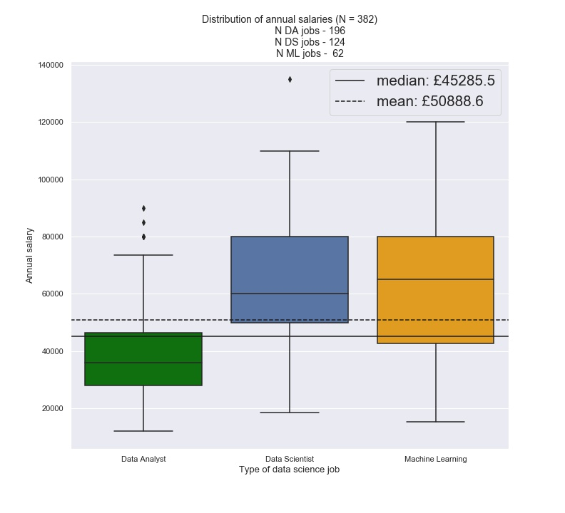
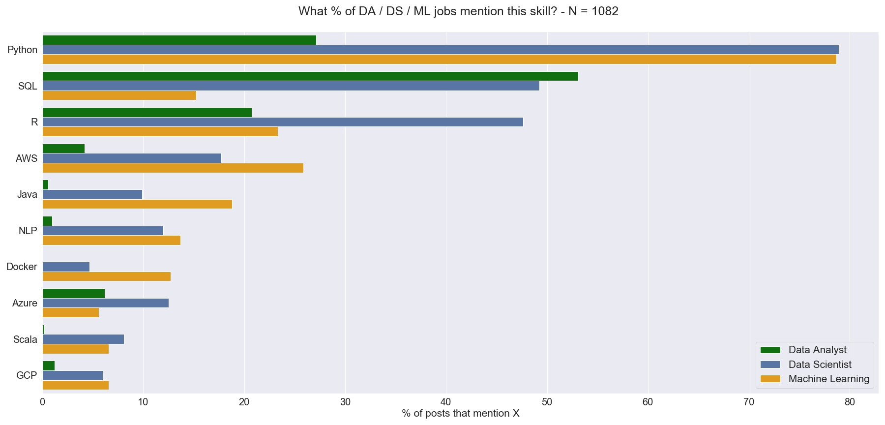

# Exploring the UK Data Science job market through Indeed job posts

I scraped 1082 job posts from Indeed.co.uk, searching for 3 different types of data science roles via the title, and then analysed the data. Please bear in mind that all the data was off one site only (I hope to be able to get job data off LinkedIn/Glassdoor at some point in the future) in late Nov 2020.

Bear in mind that this is an **exploratory project** - findings should be taken with a pinch of salt, and really the results need to be corroborated with a ~~replication of the project in 2021 or with other research. ~~ 
Update 01/06/2022:
The scraping code has been updated again and tested on a small sample (n=10) of jobs with the search term title:(data,scientist). 

* Location is now taken directly from the search results page, which seems to be returning more locations than the alternative as it is a more easily identifiable element
* "Retrieve" has been removed from the GUI options. This was originally intended for the purpose of retrieving historical data from an SQLite db, but I've mothballed that idea now since it didn't give enough clear benefits. 

### Findings 
1. Most Data Science jobs do not advertise their salary openly (only 41.5% do)
2. The median Data Science salary is about £45k; the mean is about £51k
3. The majority of roles are based in London
4. The median Data Analyst role is under £40k, whereas the median Data Scientist and Machine Learning jobs are above £60k. Roles with "Scientist" and/or "Machine learning" earn £20k more (**on average**) than roles with "Analyst" in the title. 

5. London and Cambridge have the highest average salaries; the former has the widest spread of salaries
6. If you're a median-salary London Data Analyst, you're getting paid as well as the median salary for all Data Science roles outside the company.
7. Just over 14% of overall roles are looking for a "Senior" hire. Less than 2% explicitly advertise for a 'Junior' hire. 
8. The most popular languages / skills (based on our search) were: Python, SQL, R, AWS and Azure (in decreasing order of mentions). 

9. Using feature engineering and 3 different iterations of models, I was not able to predict salary from job description and title data. This indicates that either more data is needed (likely since there only 274 data points in the training data) or that it's not possible to reliably predict the salary from such data. 
10. There was insufficient data to determine if years of experience required / requested correlated with annual salary. 
11. After using topic modelling, a few topics stood out - most noticeably the `Academic_&_Research` topic which seems to be the only one that has a moderate correlation with salary.

Full method and implementation in notebook - Data_Scientist_UK_Q4_Job_market_analysis.ipynb

--------------------------------------------------------------------------------------------------------------------------------------------------------------

## Future Steps

1. Improve webscraping process to pick up "Remote work" tags that may be stored sepately on the job website to the main text
2. Collect more data in 2021 and reiterate project to test current findings
3. Using feature engineering and regex, for future batches, determine subgroup of jobs that are research-focussed and test again if those roles do correlate with salary. 

#### Repo navigation:
- **index.ipynb** - principal notebook; questions and project plan located there. 
- **scrape_indeed_gui.py** - script for running Job Scraper Tool (built using pySimpleGui)
- archive/
-  cleaning.ipynb - notebook to check the outputs of the scraping tool's results
-  untitled.ipynb - nb used to load and check extraneous data (e.g. ONS salary information for sector)

-  clean_data/ - folder preprocessed data
-  raw_data/ folder including data as immediately outputed after webscraping stage
-  LDA_vis_plot.html - interactive visualisation of Latent Dirichlet Allocation.
-  functions.py - scripted functions and classes stored here, including webscraping tool
-  topic_mod.py - functions for topic modelling 
-  fig/ - noteable visualisations saved here
 

#### References:

* SlashData Report - 'State of the Developer Nation 19th Edition' - https://slashdata-website-cms.s3.amazonaws.com/sample_reports/y7fzAZ8e5XuKCL1Q.pdf 
* Logistic Ordinal Regression - http://fa.bianp.net/blog/2013/logistic-ordinal-regression/
* pyLDAvis Overview - https://nbviewer.jupyter.org/github/bmabey/pyLDAvis/blob/master/notebooks/pyLDAvis_overview.ipynb

#### Key Assumptions to bear in mind:
* **Data sourcing** - Data was sourced purely from Indeed.co.uk over a limited time span. The individual time of scraping is recorded for each job post inside the raw_data file raw_data/SE_jobs_20_11_2020.csv. Further sampling over time will be needed to replicate or falsify findings.
* **National averages** - ONS data was filtered to retrieve data for 2019 as 2020 data is a. not fully available yet broken down by and b. 2020 survey data was affected by the Covid19 lockdown and the move to telephone polling. Although the 2019 mean salary is not a fair comparison for data retrieved in Q3 2020, it provides a rough benchmark against which we can compare our sample. 
* **Data mining** - The salary extraction method is reliant on the pattern finding of text that "looks like salary data" - i.e. the python script that I wrote searched specifically for text that included "£" followed by any length of numbers (continuous or punctuated by a comma) and a time period phrase such as "per day", "per annum", "a year", etc. Spot-checking showed the method to be robust. Where a range was stated (e.g. "£40,000 - £50,000") the mean was taken. The same applied to regex mining for programming languages: particular challenges were encountered where languages had many variants (JavaScript for instance) or even different spelling (Javascript) - I tried to capture as many as feasible in the regex patterns. It might seem strange that the values for C++ and C# came out near zero, but, after multiple rounds of testing, I still could not find any, even though my function searching for those two languages had specific conditions written to ensure that they were detected.
* **Webscraping process** - The webscraping tool generally managed to retrieve the maximum of 19 jobs posted per page on Indeed's search result pages. The first part of the scraping had a human-in-the-loop (i.e. myself) monitoring the scraper navigating the page, to ensure data retrieval quality. Occasionally, due to an unforeseen pop-up or a nested html element, I had to scroll the automated Chrome browser in the right direction so that it would carry on retrieving new job post URLs. However, this means that some job posts may have been overlooked. This shouldn't pose a significant problem, since I was sampling from the much larger number of total available job posts, but the sampling method's randomness is reliant on the order in which Indeed presents results. 
* **Searching by title** - since we're relying on Indeed.co.uk's internal search functions, I specifically chose to input the text "title:(software, developer)"- this would only bring up a job if it contained either or both of those 2 words in any order. This would allow as well for examples such as "Software & Architecture Developer" and other valid variations. I realise of course that this would exclude perfectly valid choices from our selection, but I decided to prioritise sample purity foremost.

