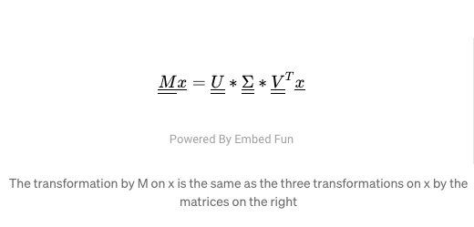
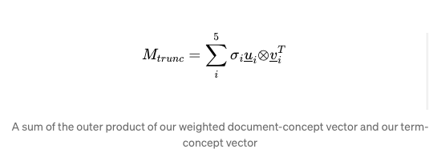

=========================================================

## How do we extract themes and topic from text using unsupervised learning
------------------------------------------------------------------------

TL;DR — Text data suffers heavily from high-dimensionality. Latent Semantic Analysis (LSA) is a popular, dimensionality-reduction techniques that follows the same method as Singular Value Decomposition. LSA ultimately reformulates text data in terms of _r_ **latent**  (i.e. **hidden**) features, where _r_ is less than _m_, the number of terms in the data. I’ll explain the **conceptual** and **mathematical** intuition  and run a basic **implementation** in [Scikit-Learn](https://scikit-learn.org/stable/index.html) using the [20 newsgroups](https://scikit-learn.org/stable/modules/generated/sklearn.datasets.fetch_20newsgroups.html) dataset.

Language is more than the collection of words in front of you. When you read a text your mind conjures up images and notions. When you read many texts, themes begin to emerge, even if they’re never stated explicitly. Our innate ability to understand and process language defies an algorithmic expression (for the moment). LSA is one of the most popular Natural Language Processing (NLP) techniques for trying to determine themes within text mathematically. LSA is an unsupervised learning technique that rests on two pillars:

*   The distributional hypothesis, which states that words with similar meanings appear frequently together. This is best summarised by JR Firth’s quote “You shall know a word by the company it keeps” \[1, p106\]
*   Singular Value Decomposition (SVD — Figure 1) a mathematical technique that we’ll be looking at in greater depth.

Note that LSA is an _unsupervised_ learning technique — there is no ground truth. The latent concepts might or might not be there! In the dataset we’ll use later we know there are 20 news categories and we can perform classification on them, but that’s only for illustrative purposes. It’ll often be the case that we’ll use LSA on unstructured, unlabelled data.

Like all Machine Learning concepts, LSA can be broken down into 3 parts: the intuition, the maths and the code. Feel free to use the links in Contents to skip to the part most relevant to you. The full code is available in this [Github repo](https://github.com/Ioana-P/pca_and_clustering_for_edu_purposes/blob/master/newsgroups_LSA.ipynb).

A note on terminology: generally when decomposition of this kind is done on text data, the terms SVD and LSA (or LSI) are used interchangeably. From now on I’ll be using LSA, for simplicity’s sake.

_This article assumes some understanding of basic NLP preprocessing and of word vectorisation (specifically_ [_tf-idf vectorisation_](https://medium.com/tf-term-frequency-idf-inverse-document-frequency-from-scratch-in-python-6c2b61b78558)_)._

### Contents:
---------

1.  [Intuition](#0c85): explanation with political news topics
2.  [The Math](#d570): SVD as a weighted, ordered sum of matrices **or** as a set of 3 linear transformations
3.  [The code implementation](#04db): in Python3 with Scikit-Learn and 20Newsgroups data
4.  [References](#a131)

1\. Intuition
=============

([return to Contents](#3ce3))

In simple terms: LSA takes meaningful text documents and recreates them in _n_ different parts where each part expresses a different way of looking at meaning in the text. If you imagine the text data as a an idea, there would be _n_ different ways of _looking_ at that idea, or _n_ different ways of _conceptualising_ the whole text. LSA reduces our table of data to a table of latent (hidden_)_ concepts.

Figure 1: formula and matrix dimensions for SVD

Suppose that we have some table of data, in this case text data, where each row is one document, and each column represents a term (which can be a word or a group of words, like “baker’s dozen” or “Downing Street”). This is the standard way to represent text data (in a _document-term matrix_, as shown in Figure 2). The numbers in the table reflect how important that word is in the document. If the number is zero then that word simply doesn’t appear in that document.

Figure 2: Document Term matrix, after applying some sort of vectorisation, in our case TF-IDF (but Bag of Words would also do)

Different documents will be about different topics. Let’s say all the documents are **politics** articles and there are 3 topics: **foreign policy (F.P.), elections and reform**.

Figure 3: Document-Topic matrix (or Document- **Latent**\-Concept if you prefer)

Let’s say that there are articles strongly belonging to each category, some that are in two and some that belong to all 3 categories. We could plot a table where each row is a different document (a news article) and each column is a different topic. In the cells we would have a different numbers that indicated how strongly that document belonged to the particular topic (see Figure 3).

Now if we shift our attention conceptually to the **topics** themselves, we should ask ourselves the following question: _do we expect certain_ **_words_** _to turn up more often in either of these topics?_

If we’re looking at foreign policy, we might see terms like “Middle East”, “EU”, “embassies”. For elections it might be “ballot”, “candidates”, “party”; and for reform we might see “bill”, “amendment” or “corruption”. So, if we plotted these topics and these terms in a different table, where the rows are the terms, we would see scores plotted for each term according to which topic it most strongly belonged. Naturally there will be terms that feature in all three documents (“prime minister”, “Parliament”, “decision”) and these terms will have scores across all 3 columns that reflect how much they belong to either category — the higher the number, the greater its affiliation to that topic. So, our second table (Figure 4) consists of terms and topics.

Figure 4: Term — Topic matrix

Now the last component is a bit trickier to explain as a table. It’s actually a set of numbers, one for each of our topics. What do the numbers represent? They represent how much each of the topics _explains_ our data.

How do they “explain” the data? Well, suppose that actually, “reform” wasn’t really a salient topic across our articles, and the majority of the articles fit in far more comfortably in the “foreign policy” and “elections”. Thus “reform” would get a really low number in this set, lower than the other two. An alternative is that maybe all three numbers are actually quite low and we actually should have had four or more topics — we find out later that a lot of our articles were actually concerned with economics! By sticking to just three topics we’ve been denying ourselves the chance to get a more detailed and precise look at our data. The technical name for this array of numbers is the “singular values”.

Figure 5: Singular values — what is the relative importance of our topics within our text?

So that’s the intuition so far. You’ll notice that our two tables have one thing in common (the documents / articles) and all three of them have one thing in common — the topics, or some representation of them.

Now let’s explain how this is a dimensionality reduction technique. It’s easier to see the merits if we specify a number of documents and topics. Suppose we had 100 articles and 10,000 different terms (just think of how many unique words there would be all those articles, from “amendment” to “zealous”!). In our original document-term matrix that’s 100 rows and 10,000 columns. When we start to break our data down into the 3 components, we can actually choose the number of topics — we could choose to have 10,000 different topics, if we genuinely thought that was reasonable. However, we could probably represent the data with far fewer topics, let’s say the 3 we originally talked about. That means that in our document-topic table, we’d slash about _99,997 columns_, and in our term-topic table, we’d do the same. The columns and rows we’re discarding from our tables are shown as hashed rectangles in Figure 6. M  is the original document-term table; _U_ is the document-topic table, 𝚺 (sigma) is the array of singular values and _V-transpose_ (the superscript T means that the original matrix T has been flipped along its diagonal) is the document-topic table, but flipped on its diagonal (I’ll explain why in the math section).

Figure 6 — what’s hashed we discard

As for the set of numbers denoting topic importance, from a set of 10,000 numbers, each number getting smaller and smaller as it corresponds to a less important topic, we cut down to only 3 numbers, for our 3 remaining topics. This is why the Python implementation for LSA is called _Truncated_ SVD by the way: we’re cutting off part of our table, but we’ll get to the code later. It’s also worth noting that we don’t know what the 3 topics are in advance, we merely hypothesised that there would be 3 and, once we’ve gotten our components, we can explore them and see what the terms are.

Of course, we don’t just want to return to the original dataset: we now have 3 lower-dimensional components we can use. In the code and maths parts we’ll go through which one we actually take forward. In brief, once we’ve truncated the tables (matrices), the product we’ll be getting out is the document-topic table (_U_) _times_ the singular values (𝚺). This can be interpreted as the documents (all our news articles) along with how much they belong to each topic then **weighted** by the relative importance of each topic. You’ll notice that in that case something’s been left out of this final table — the _words._ Yes, we’ve gone beyond the words, we’re discarding them but keeping _the themes_, which is a much more compact way to express our text.

2\. The Math
============

([return to Contents](#3ce3))

For the maths, I’ll be going through two different interpretations of SVD: first the general geometric decomposition that you can use with a real square matrix M and second the separable-models decomposition which is more pertinent to our example. SVD is also used in model-based recommendation systems. It is very similar to Principal Component Analysis (PCA), but it operates better on sparse data than PCA does (and text data is almost always sparse). Whereas PCA performs decomposition on the _correlation_ matrix of a dataset, SVD/LSA performs decomposition directly on the dataset as it is.

We will be **factorising** this matrix into constituent matrices. When I say factorising this is essentially the same as when we’re taking a number and representing it its factors, which when multiplied together, give us the original number, e.g. A = B \* C \* D .

This is also why it’s called Singular Value **Decomposition** — we’re _decomposing_ it into its constituent parts.

General geometric decomposition
-------------------------------

The extra dimension that wasn’t available to us in our original matrix, the _r_ dimension, is the amount of _latent concepts_. Generally we’re trying to represent our matrix as other matrices that have one of their axes being this set of components. You will also note that, based on dimensions, the multiplication of the 3 matrices (when V is transposed) will lead us back to the shape of our original matrix, the _r_ dimension effectively disappearing.

What matters in understanding the math is not the algebraic algorithm by which each number in U, V and 𝚺 is determined, but the mathematical properties of these products and how they relate to each other.

First of all, it’s important to consider first what a matrix actually is and what it can be thought of — a transformation of vector space. In the top left corner of Figure 7 we have two perpendicular vectors. If we have only two variables to start with then the feature space (the data that we’re looking at) can be plotted anywhere in this space that is described by these two **basis** vectors. Now moving to the right in our diagram, the matrix M is applied to this vector space and this transforms it into the new, transformed space in our top right corner. In the diagram below the geometric effect of M would be referred to as “shearing” the vector space; the two vectors _𝝈1_ and _𝝈2_ are actually our singular values plotted in this space.

Figure 7: Source: Wikipedia; [Singular Value Decomposition](https://en.wikipedia.org/wiki/Singular_value_decomposition); [link](https://commons.wikimedia.org/wiki/File:Singular-Value-Decomposition.svg#filelinks;); Author : Georg-Johann

Now, just like with geometric transformations of points that you may remember from school, we can reconsider this transformation _M_ as three separate transformations:

1.  The rotation (or reflection) caused by _V\*._ Note that _V\* = V-transpose_ as V is a real unitary matrix, so the complex conjugate of V is the same as its transpose. In vector terms, the transformation by V or _V\*_ keeps the length of the basis vectors the same;
2.  𝚺 has the effect of stretching or compressing all coordinate points along the values of its singular values. Imagine our disc in the bottom left corner as we squeeze it vertically down in the direction of _𝝈2_ and stretch it horizontally along the direction of _𝝈1_. These two singular values now can be pictured as the major and minor semi-axes of an ellipse. You can of course generalise this to _n_\-dimensions.
3.  Lastly, applying _U_ rotates (or reflects) our feature space. We’ve arrived at the same output as a transformation directly from _M_.

I also recommend the excellent [Wikipedia entry on SVD](https://en.wikipedia.org/wiki/Singular_value_decomposition) as it has a particularly good explanation and GIF of the process.

So, in other words, where _x_ is any column vector:



The transformation by M on x is the same as the three transformations on x by the matrices on the right

One of the properties of the matrices _U_ and _V\*_ is that they’re unitary, so we can say that the columns of both of these matrices form two sets of orthonormal basis vectors. In other words, the column vectors you can get from U would form their own coordinate space, such that if there were two columns _U1_ and _U2,_ you could write out all of the coordinates of the space as combinations of _U1_ and _U2_. The same applies to the columns of _V_, _V1_ and _V2,_ and this would generalise to _n_\-dimensions (you’d have _n_\-columns).

Separable models decomposition
==============================

We can arrive at the same understanding of PCA if we imagine that our matrix M can be broken down into a weighted sum of separable matrices, as shown below.

Decomposition of our data M into a weighted sum of separable matrices, _Ai_

The matrices 𝐴𝑖 are said to be separable because they can be decomposed into the outer product of two vectors, weighted by the singular value 𝝈_i_. Calculating the outer product of two vectors with shapes (_m,_) and (_n,_) would give us a matrix with a shape (m,n). In other words, every possible product of any two numbers in the two vectors is computed and placed in the new matrix. The singular value not only weights the sum but orders it, since the values are arranged in descending order, so that the first singular value is always the highest one.

Figure 8: our separable matrices. Note the ≅ sign is representing the fact that the decomposed set of 3 products only **approximates** our original matrix, it does not equal it exactly.

In Figure 8 you can see how you could visualise this. Previously we had the tall _U_, the square _Σ_ and the long 𝑉-_transpose_ matrices. Now you can picture taking the first vertical slice from _U_, weighting (multiplying) all its values by the first singular value and then, by doing an outer product with the first horizontal slice of 𝑉_\-transpose_, creating a new matrix with the dimensions of those slices. Then we add those products together and we get _M_. Or, if we don’t do the full sum but only complete it partially, we get the truncated version.

So, for our data:

*   where _M_ is our original (_m, n_) data matrix — m rows, n columns; _m documents, n terms_
*   U is a (_m, r_) matrix — _m documents and r concepts_
*   Σ is a _diagonal_ (_r , r_) matrix — all values except those in the diagonal are zero. (But what do the non-zero values represent?
*   V is a (_n, r_) matrix — _n terms, r concepts_

The values in 𝚺 represent how much each latent concept explains the variance in our data. When these are multiplied by the _u_ column vector for that latent concept, it will effectively weigh that vector.

If we were to decompose this to 5 components, this would look something like this:



A sum of the outer product of our weighted document-concept vector and our term-concept vector

where there would be originally _r_ number of _u_ vectors; 5 singular values and n number of 𝑣_\-transpose_ vectors.

3\. The code implementation
===========================

([return to Contents](#3ce3))

In this last section we’ll see how we can implement basic LSA using Scikit-Learn.

Extract, Transform and Load our text data
-----------------------------------------

```
from sklearn.datasets import fetch\_20newsgroups  
X\_train, y\_train = fetch\_20newsgroups(subset='train', return\_X\_y=True)  
X\_test, y\_test = fetch\_20newsgroups(subset='test', return\_X\_y=True)
```

Cleaning and Preprocessing
--------------------------

The cleaning of text data is often a very different beast from cleaning of numerical data. You’ll often find yourself having prepared your vectoriser, you model and you’re ready to Gridsearch and then extract features, only to find that the most important features in cluster _x_ is the string “\_\_\_” … so you go back…and do more cleaning. The code block below came about as a result of me realizing that I needed to remove website URLs, numbers and emails from the dataset.

```
from nltk.corpus import stopwords  
from nltk.tokenize import RegexpTokenizer  
import re  
tokenizer = RegexpTokenizer(r'\\b\\w{3,}\\b')  
stop\_words = list(set(stopwords.words("english")))  
stop\_words += list(string.punctuation)  
stop\_words += \['\_\_', '\_\_\_'\]\# Uncomment and run the 3 lines below if you haven't got these packages already  
\# nltk.download('stopwords')  
\# nltk.download('punkt')  
\# nltk.download('wordnet')def rmv\_emails\_websites(string):  
    """Function removes emails, websites and numbers""" new\_str = re.sub(r"\\S+@\\S+", '', string)  
    new\_str = re.sub(r"\\S+.co\\S+", '', new\_str)  
    new\_str = re.sub(r"\\S+.ed\\S+", '', new\_str)  
    new\_str = re.sub(r"\[0-9\]+", '', new\_str)  
    return new\_strX\_train = list(map(rmv\_emails\_websites, X\_train))  
X\_test  = list(map(rmv\_emails\_websites, X\_test))
```

Tokenising and vectorising text data
------------------------------------

Our models work on numbers, not string! So we tokenise the text (turning all documents into smaller observational entities — in this case words) and then turn them into numbers using Sklearn’s TF-IDF vectoriser. I recommend with any transformation process (especially ones that take time to run) you do them on the first 10 rows of your data and inspect results: are they what you expected to see? Is the shape of the dataframe what you hoped for? Once you’re feeling confident of your code, feed in the whole corpus.

```
tfidf = TfidfVectorizer(lowercase=True,   
                        stop\_words=stop\_words,   
                        tokenizer=tokenizer.tokenize,   
                        max\_df=0.2,  
                        min\_df=0.02  
                       )  
tfidf\_train\_sparse = tfidf.fit\_transform(X\_train)  
tfidf\_train\_df = pd.DataFrame(tfidf\_train\_sparse.toarray(),   
                        columns=tfidf.get\_feature\_names())  
tfidf\_train\_df.head()
```

This should give you your vectorised text data — the document-term matrix. Repeat the steps above for the test set as well, but **only** using transform, **not** fit\_transform.

LSA for Exploratory Data Analysis (EDA)
---------------------------------------

Just for the purpose of visualisation and EDA of our decomposed data, let’s fit our LSA object (which in Sklearn is the [TruncatedSVD class](https://scikit-learn.org/stable/modules/generated/sklearn.decomposition.TruncatedSVD.html)) to our train data and specifying only 20 components.

```
from sklearn.decomposition import TruncatedSVDlsa\_obj = TruncatedSVD(n\_components=20, n\_iter=100, random\_state=42)tfidf\_lsa\_data = lsa\_obj.fit\_transform(tfidf\_train\_df)  
Sigma = lsa\_obj.singular\_values\_  
V\_T = lsa\_obj.components\_.T
```

Now let’s visualise the singular values — is the barplot below showing us what we expected of them?

```
sns.barplot(x=list(range(len(Sigma))), y = Sigma)
```

Figure 9 — our singular values, representing how much each latent concept _explains the variance in the data_

Let’s explore our reduced data through the term-topic matrix, _V-tranpose._ TruncatedSVD will return it to as a numpy array of shape (num\_documents, num\_components), so we’ll turn it into a Pandas dataframe for ease of manipulation.

```
term\_topic\_matrix = pd.DataFrame(data=lsa\_term\_topic,   
                                 index = eda\_train.columns,   
                                 columns = \[f'Latent\_concept\_{r}' for r in range(0,V\_T.shape\[1\])\])
```

Let’s slice our term-topic matrix into Pandas Series (single column data-frames), sort them by value and plot them. The code below plots this for our 2nd latent component (recall that in python we start counting from 0) and returns the plot in Figure 10:

```
data = term\_topic\_matrix\[f'Latent\_concept\_1'\]  
data = data.sort\_values(ascending=False)  
top\_10 = data\[:10\]  
plt.title('Top terms along the axis of Latent concept 1')  
fig = sns.barplot(x= top\_10.values, y=top\_10.index)
```
Figure 10: despite the seeming noise at least 3 terms here have a strong theme

These are the words that rank highly along our 2nd latent component. What about the words at the other end of this axis (see Fig 11)?

Figure 11: it was at this moment the author appreciated how useful lemming/stemming would’ve been

You can make your own mind up about that this semantic divergence signifies. Adding more preprocessing steps would help us cleave through the noise that words like “say” and “said” are creating, but we’ll press on for now. Let’s do one more pair of visualisations for the 6th latent concept (Figures 12 and 13).

Figure 12
Figure 13: we see once again that technological terms feature strongly in this data

At this point it’s up to us to infer some meaning from these plots. The negative end of concept 5’s axis seems to correlate very strongly with technological and scientific themes (‘space’, ‘science’, ‘computer’), but so does the positive end, albeit more focused on computer related terms (‘hard’, ‘drive’, ‘system’).

Now just to be clear, determining the right amount of components will require tuning, so I didn’t leave the argument set to 20, but changed it to 100. You might think that’s still a large number of dimensions, but our original was 220 (and that was with constraints on our minimum document frequency!), so we’ve reduced a sizeable chunk of the data. I’ll explore in another post how to choose the optimal number of singular values. For now we’ll just go forward with what we have.

Using our latent components in our modelling task
-------------------------------------------------

Although LSA is an unsupervised technique often used to find patterns in unlabelled data, we’re using it here to reduce the dimensions of labelled data before feeing it into a model. We’ll compare our accuracy on the LSA data with the accuracy on our standard TF-IDF data to gauge how much useful information the LSA has captured from the original dataset. We now have a train dataset of shape (11314, 100). The number of documents is preserved and we have created 100 latent concepts. Now let’s run a model on this and on our standard TF-IDF data. The aim of the implementation below isn’t to get a great model, but to compare the two very different datasets. I’ve included basic cross validation through GridSearchCV and performed a tiny amount of tuning for the tolerance hyperparameter. If you were to do this for the sake of building an actual model, you would go much farther than what’s written below. This is just to help you get a basic implementation going:

```
logreg\_lsa = LogisticRegression()  
logreg     = LogisticRegression()  
logreg\_param\_grid = \[{'penalty':\['l1', 'l2'\]},  
                 {'tol':\[0.0001, 0.0005, 0.001\]}\]grid\_lsa\_log = GridSearchCV(estimator=logreg\_lsa,  
                        param\_grid=logreg\_param\_grid,   
                        scoring='accuracy', cv=5,  
                        n\_jobs=-1)grid\_log = GridSearchCV(estimator=logreg,  
                        param\_grid=logreg\_param\_grid,   
                        scoring='accuracy', cv=5,  
                        n\_jobs=-1)best\_lsa\_logreg = grid\_lsa\_log.fit(tfidf\_lsa\_data, y\_train).best\_estimator\_  
best\_reg\_logreg = grid\_log.fit(tfidf\_train\_df, y\_train).best\_estimator\_print("Accuracy of Logistic Regression on LSA train data is :", best\_lsa\_logreg.score(tfidf\_lsa\_data, y\_train))  
print("Accuracy of Logistic Regression with standard train data is :", best\_reg\_logreg.score(tfidf\_train\_df, y\_train))
```

Which returns:

```
Accuracy of Logistic Regression on LSA train data is : 0.45  
Accuracy of Logistic Regression with standard train data is : 0.52
```

The drop in performance is significant, but you can work this into an optimisation pipeline and tweak the number of latent components. How does this perform on our test data (7532 documents) though?

```
Accuracy of Logistic Regression on LSA test data is : 0.35  
Accuracy of Logistic Regression on standard test data is : 0.37
```

Accuracy has dropped greatly for both, but notice how small the gap between the models is! Our LSA model is able to capture about as much information from our test data as our standard model did, with less than half the dimensions! Since this is a multi-label classification it would be best to visualise this with a confusion matrix (Figure 14). Our results look significantly better when you consider the random classification probability given 20 news categories. If you’re not familiar with a confusion matrix, as a rule of thumb, we want to maximise the numbers down the diagonal and minimise them everywhere else.

Figure 14— [Confusion matrix](https://scikit-learn.org/stable/modules/generated/sklearn.metrics.confusion_matrix.html) for our test data (7532 documents). y-axis represents actual news categories, x-axis represents predicted news categories. The diagonal values are all the correctly classified documents.

And that concludes our implementation of LSA in Scikit-Learn. We’ve covered the intuition, mathematics and coding of this technique.

I hope you’ve enjoyed this post and would appreciate any amount of claps. Feel free to leave any feedback (positive or constructive) in the comments, especially about the math section, since I found that the most challenging to articulate.

4\. References
==============

([return to Contents](http://3ce3))

References:
-----------

\[1\] L. Hobson, H. Cole, H. Hapke, [Natural Language Processing in Action](https://www.manning.com/books/natural-language-processing-in-action) (2019), [https://www.manning.com/books/natural-language-processing-in-action](https://www.manning.com/books/natural-language-processing-in-action)

\[2\] Pedregosa _et al.,_ [Scikit-learn: Machine Learning in Python](http://jmlr.csail.mit.edu/papers/v12/pedregosa11a.html) (2011), JMLR 12, pp. 2825–2830.

\[3\] [Hamdaoui](https://towardsdatascience.com/@yassine.hamdaoui?source=post_page-----6c2b61b78558----------------------) Y, [TF(Term Frequency)-IDF(Inverse Document Frequency) from scratch in python](https://medium.com/tf-term-frequency-idf-inverse-document-frequency-from-scratch-in-python-6c2b61b78558) (2019), Towards Data Science

\[4\] Wikipedia contributers, [Singular Value Decomposition](https://en.wikipedia.org/wiki/Singular_value_decomposition), [https://en.wikipedia.org/wiki/Singular\_value\_decomposition](https://en.wikipedia.org/wiki/Singular_value_decomposition)
